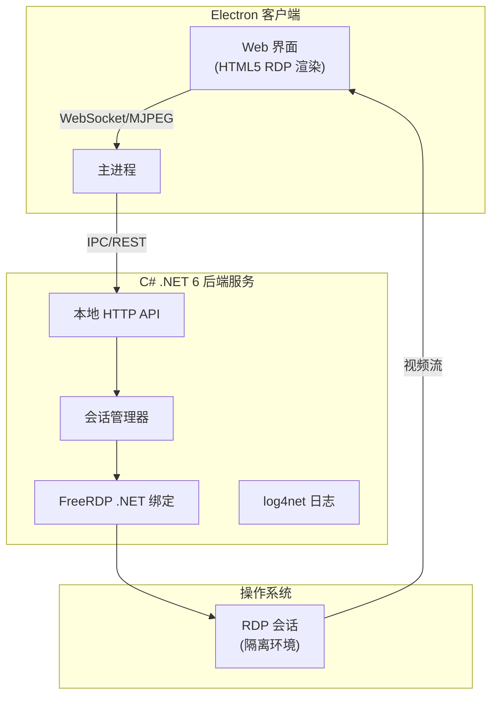

# WebRDP 项目架构

## 技术栈

- **运行时**: .NET 6 (跨平台：Windows + UOS)
- **RDP 引擎**: FreeRDP (开源，可免费商用)
- **容器**: Electron 客户端
- **日志**: log4net v2.0.13

## 架构模式

## 核心组件

1. **Electron 主进程**: 管理 C# 后端服务生命周期
2. **C# 本地服务**: 提供 RDP 会话管理 API
3. **会话管理器**: 控制会话创建、重连、销毁
4. **FreeRDP 封装**: 跨平台 RDP 协议实现
5. **HTML5 渲染器**: 在 Web 窗体中显示 RDP 会话

## 通信协议

- **Electron <-> C#**: REST API (localhost) + IPC
- **C# <-> FreeRDP**: .NET 绑定库
- **RDP 流传输**: WebSocket / MJPEG 流

## 部署架构

- Windows: 127.0.0.2:3389 (可配置)
- UOS: 127.0.0.2:3389 (可配置)
