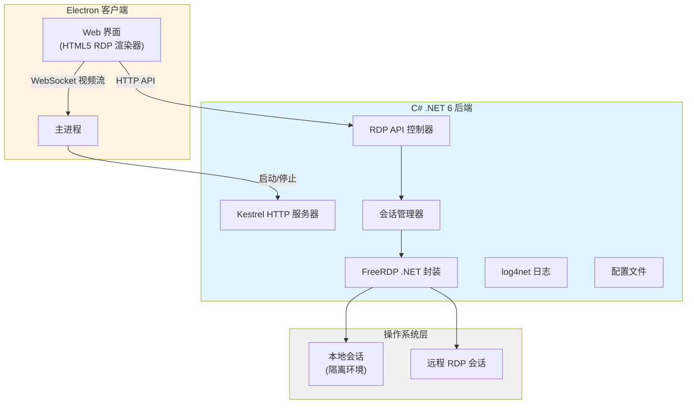

# WebRDP 技术方案

**需求名称**: webrdp  
**更新日期**: 2026-04-16

## 描述

实现一个能够内置到 Electron 客户端中的 Web RDP 解决方案，底层使用 C# .NET 6 和 FreeRDP 库，支持 Windows 和 UOS 跨平台运行。

### 核心功能

1. 通过可配置的本地地址 (如 127.0.0.2:3389) 创建隔离的本地桌面新会话
2. 新会话在 Electron Web 窗体中渲染显示，本地无 FreeRDP 窗口
3. 用户预设用户名密码，点击连接后自动创建/重连会话
4. 会话复用：同一时间最多一个本地会话 + 一个远程会话
5. 近 0 延迟的鼠标键盘操作，支持完整的桌面应用操作
6. 内网环境运行，不依赖外网

---

## 架构



### 组件说明

1. **Electron 主进程**: 负责启动/停止 C# 后端服务，管理进程生命周期
2. **Kestrel HTTP 服务器**: 提供 RESTful API，监听 localhost
3. **会话管理器**: 管理会话状态，实现会话复用和重连逻辑
4. **FreeRDP 封装层**: 跨平台 FreeRDP .NET 绑定，处理 RDP 协议
5. **HTML5 渲染器**: 接收视频流，实现低延迟输入输出

---

## 组件和接口

### 1. C# 后端 API 接口

```csharp
// RDP 会话控制 API
POST   /api/rdp/connect      // 创建/连接会话
DELETE /api/rdp/disconnect   // 断开会话
GET    /api/rdp/status       // 获取会话状态
POST   /api/rdp/input        // 发送输入事件 (键盘/鼠标)
GET    /api/rdp/stream       // WebSocket 视频流
```

### 2. 会话管理器

```csharp
public interface IRdpSessionManager
{
    Task<RdpSession> ConnectAsync(RdpConnectionConfig config);
    Task DisconnectAsync(string sessionId);
    Task<RdpSessionStatus> GetStatusAsync(string sessionId);
    RdpSession? GetExistingSession(); // 获取未注销的会话
}
```

### 3. FreeRDP 封装

```csharp
public interface IFreeRdpClient : IDisposable
{
    event EventHandler<FrameEventArgs> FrameReady;
    Task ConnectAsync(RdpConnectionConfig config);
    Task SendInputAsync(InputEvent input);
    Task DisconnectAsync();
}
```

### 4. Electron 集成

```typescript
// Electron 主进程
const rdpService = new CsharpRdpService();
await rdpService.start(); // 启动 C# HTTP 服务

// Web 界面
const ws = new WebSocket('ws://localhost:5000/rdp/stream');
ws.onmessage = (event) => renderFrame(event.data);
```

---

## 数据结构

### 连接配置

```csharp
public class RdpConnectionConfig
{
    public string Host { get; set; } = "127.0.0.2";
    public int Port { get; set; } = 3389;
    public string Username { get; set; }
    public string Password { get; set; }
    public int Width { get; set; } = 1920;
    public int Height { get; set; } = 1080;
    public int ColorDepth { get; set; } = 32;
    public string LocalSessionId { get; set; } // 本地会话 ID
}
```

### 会话状态

```csharp
public enum RdpSessionStatus
{
    Disconnected,
    Connecting,
    Connected,
    Reconnecting,
    Error
}

public class RdpSession
{
    public string Id { get; set; }
    public RdpSessionStatus Status { get; set; }
    public DateTime CreatedAt { get; set; }
    public DateTime? LastActiveAt { get; set; }
    public RdpConnectionConfig Config { get; set; }
}
```

---

## 正确性属性

1. **会话唯一性**: 同一时间最多存在一个本地会话和一个远程会话
2. **会话复用**: 未注销的会话应被重用，而非创建新会话
3. **资源清理**: 会话断开时必须释放所有 FreeRDP 资源
4. **输入同步**: 鼠标键盘输入延迟 < 50ms
5. **跨平台一致性**: Windows 和 UOS 行为一致

---

## 错误处理

### 连接错误

- **认证失败**: 返回明确的错误码，不重试
- **网络不可达**: 重试 3 次，每次间隔 2 秒
- **会话已存在**: 返回现有会话信息

### 运行期错误

- **FreeRDP 崩溃**: 自动重启 C# 服务，记录 crash dump
- **视频流中断**: 自动重连 WebSocket
- **资源泄漏**: 实现 IDisposable 模式，确保资源释放

---

## 测试策略

### 单元测试 (xUnit)

- FreeRDP 封装层单元测试
- 会话管理器逻辑测试
- 会话复用逻辑验证
- 资源清理测试

### 集成测试

- C# 服务启动/停止测试
- Electron 与 C# 通信测试
- 完整连接流程测试

### 手动测试

- Windows 10/11 实际运行
- UOS 实际运行
- 性能测试 (延迟、帧率)

---

## 技术决策

### 1. 为什么选择 .NET 6？

- 跨平台支持 (Windows + Linux/UOS)
- 性能优于 .NET Framework
- 长期支持版本 (LTS)

### 2. 为什么使用 FreeRDP .NET 绑定？

- 避免重复造轮子
- 开源可商用 (Apache 2.0)
- 成熟的 RDP 协议实现

### 3. 为什么不使用命令行调用 FreeRDP？

- 进程间通信延迟高
- 难以实现精细控制
- 资源管理复杂

### 4. 为什么选择 Kestrel 而不是 HttpListener？

- 跨平台支持更好
- 性能更优
- 支持 WebSocket 原生

---

## 待确认问题

请您确认以下技术细节：

1. **FreeRDP .NET 绑定库选择**: 是否有已有推荐的库？还是需要我调研现有的开源库？
2. **本地会话隔离级别**: UOS 系统上如何实现会话隔离？是否有系统特定的 API？
3. **视频流传输协议**: 优先使用 WebSocket 二进制流还是 MJPEG over HTTP？
4. **Electron 与 C# 通信**: 除了 HTTP API，是否需要额外的命名管道 (Named Pipe) 用于进程控制？

---

## 下一步

**请您确认**:

1. 以上技术方案的**大体方向是否正确**？
2. 是否有需要**补充或修改**的地方？
3. 如果没有需要补充的，我将开始生成**详细的完整方案文档**，包括具体的代码实现、单元测试方案、问题记录文档等。

请回复您的意见，我好继续完善方案。
