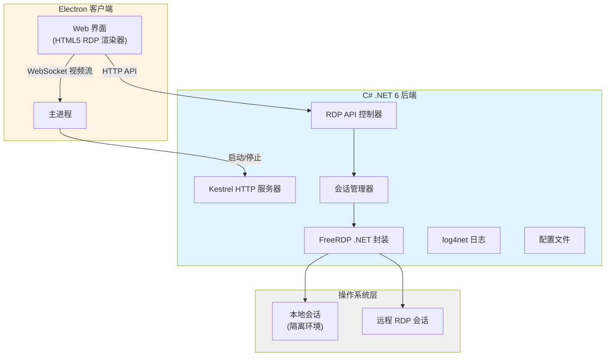

# WebRDP 技术方案

**需求名称**: webrdp  
**更新日期**: 2026-04-16

## 描述

实现一个能够内置到 Electron 客户端中的 Web RDP 解决方案，底层使用 C# .NET 6 和 FreeRDP 库，支持 Windows 和 UOS 跨平台运行。

### 核心功能

1. 通过可配置的本地地址 (如 127.0.0.2:3389) 创建隔离的本地桌面新会话
2. 新会话在 Electron Web 窗体中渲染显示，本地无 FreeRDP 窗口
3. 用户预设用户名密码，点击连接后自动创建/重连会话
4. 会话复用：同一时间最多一个本地会话 + 一个远程会话
5. 近 0 延迟的鼠标键盘操作，支持完整的桌面应用操作
6. 内网环境运行，不依赖外网

---

## 架构



### 组件说明

1. **Electron 主进程**: 负责启动/停止 C# 后端服务，管理进程生命周期
2. **Kestrel HTTP 服务器**: 提供 RESTful API，监听 localhost
3. **会话管理器**: 管理会话状态，实现会话复用和重连逻辑
4. **FreeRDP 封装层**: 跨平台 FreeRDP .NET 绑定，处理 RDP 协议
5. **HTML5 渲染器**: 接收视频流，实现低延迟输入输出

---

## 组件和接口

### 1. C# 后端 API 接口

```csharp
// RDP 会话控制 API
POST   /api/rdp/connect      // 创建/连接会话
DELETE /api/rdp/disconnect   // 断开会话
GET    /api/rdp/status       // 获取会话状态
POST   /api/rdp/input        // 发送输入事件 (键盘/鼠标)
GET    /api/rdp/stream       // WebSocket 视频流
```

### 2. 会话管理器

```csharp
public interface IRdpSessionManager
{
    Task<RdpSession> ConnectAsync(RdpConnectionConfig config);
    Task DisconnectAsync(string sessionId);
    Task<RdpSessionStatus> GetStatusAsync(string sessionId);
    RdpSession? GetExistingSession(); // 获取未注销的会话
}
```

### 3. FreeRDP 封装

```csharp
public interface IFreeRdpClient : IDisposable
{
    event EventHandler<FrameEventArgs> FrameReady;
    Task ConnectAsync(RdpConnectionConfig config);
    Task SendInputAsync(InputEvent input);
    Task DisconnectAsync();
}
```

### 4. Electron 集成

```typescript
// Electron 主进程
const rdpService = new CsharpRdpService();
await rdpService.start(); // 启动 C# HTTP 服务

// Web 界面
const ws = new WebSocket('ws://localhost:5000/rdp/stream');
ws.onmessage = (event) => renderFrame(event.data);
```

---

## 数据结构

### 连接配置

```csharp
public class RdpConnectionConfig
{
    public string Host { get; set; } = "127.0.0.2";
    public int Port { get; set; } = 3389;
    public string Username { get; set; }
    public string Password { get; set; }
    public int Width { get; set; } = 1920;
    public int Height { get; set; } = 1080;
    public int ColorDepth { get; set; } = 32;
    public string LocalSessionId { get; set; } // 本地会话 ID
}
```

### 会话状态

```csharp
public enum RdpSessionStatus
{
    Disconnected,
    Connecting,
    Connected,
    Reconnecting,
    Error
}

public class RdpSession
{
    public string Id { get; set; }
    public RdpSessionStatus Status { get; set; }
    public DateTime CreatedAt { get; set; }
    public DateTime? LastActiveAt { get; set; }
    public RdpConnectionConfig Config { get; set; }
}
```

---

## 正确性属性

1. **会话唯一性**: 同一时间最多存在一个本地会话和一个远程会话
2. **会话复用**: 未注销的会话应被重用，而非创建新会话
3. **资源清理**: 会话断开时必须释放所有 FreeRDP 资源
4. **输入同步**: 鼠标键盘输入延迟 < 50ms
5. **跨平台一致性**: Windows 和 UOS 行为一致

---

## 错误处理

### 连接错误

- **认证失败**: 返回明确的错误码，不重试
- **网络不可达**: 重试 3 次，每次间隔 2 秒
- **会话已存在**: 返回现有会话信息

### 运行期错误

- **FreeRDP 崩溃**: 自动重启 C# 服务，记录 crash dump
- **视频流中断**: 自动重连 WebSocket
- **资源泄漏**: 实现 IDisposable 模式，确保资源释放

---

## 测试策略

### 单元测试 (xUnit)

- FreeRDP 封装层单元测试
- 会话管理器逻辑测试
- 会话复用逻辑验证
- 资源清理测试

### 集成测试

- C# 服务启动/停止测试
- Electron 与 C# 通信测试
- 完整连接流程测试

### 手动测试

- Windows 10/11 实际运行
- UOS 实际运行
- 性能测试 (延迟、帧率)

---

## 技术决策

### 1. 为什么选择 .NET 6？

- 跨平台支持 (Windows + Linux/UOS)
- 性能优于 .NET Framework
- 长期支持版本 (LTS)

### 2. 为什么使用 FreeRDP .NET 绑定？

- 避免重复造轮子
- 开源可商用 (Apache 2.0)
- 成熟的 RDP 协议实现

### 3. 为什么不使用命令行调用 FreeRDP？

- 进程间通信延迟高
- 难以实现精细控制
- 资源管理复杂

### 4. 为什么选择 Kestrel 而不是 HttpListener？

- 跨平台支持更好
- 性能更优
- 支持 WebSocket 原生

---

## 详细实现方案

### 项目结构

```
WebRDP/
├── src/
│   ├── WebRdp.Service/          # C# .NET 6 后端服务
│   │   ├── Controllers/         # API 控制器
│   │   ├── Services/            # 业务服务
│   │   │   ├── RdpSessionManager.cs
│   │   │   └── FreeRdpClient.cs
│   │   ├── Models/              # 数据模型
│   │   ├── Logging/             # log4net 配置
│   │   ├── appsettings.json     # 配置文件
│   │   └── Program.cs           # 入口
│   ├── WebRdp.Client/           # FreeRDP .NET 封装库
│   │   ├── Native/              # P/Invoke 声明
│   │   ├── FreeRdpContext.cs
│   │   └── EventHandlers.cs
│   └── WebRdp.Web/              # Electron Web 界面
│       ├── renderer/            # 渲染进程
│       ├── main/                # 主进程
│       └── preload/             # 预加载脚本
├── tests/
│   ├── WebRdp.Service.Tests/    # 服务层单元测试
│   └── WebRdp.Client.Tests/     # FreeRDP 封装测试
├── docs/
│   └── issues-log.md            # 问题记录文档
└── README.md
```

### 1. C# 后端服务实现

#### Program.cs

```csharp
using Microsoft.AspNetCore.Builder;
using Microsoft.Extensions.DependencyInjection;
using Microsoft.Extensions.Hosting;
using WebRdp.Service.Controllers;
using WebRdp.Service.Services;
using log4net;
using log4net.Config;
using System.IO;

var logger = LogManager.GetLogger(typeof(Program));
XmlConfigurator.Configure(new FileInfo("log4net.config"));

logger.Info("WebRDP Service starting...");

var builder = WebApplication.CreateBuilder(args);

// 添加服务
builder.Services.AddSingleton<IRdpSessionManager, RdpSessionManager>();
builder.Services.AddSingleton<IFreeRdpClientFactory, FreeRdpClientFactory>();
builder.Services.AddControllers();
builder.Services.AddCors(options =>
{
    options.AddPolicy("AllowElectron",
        policy => policy
            .WithOrigins("http://localhost:*")
            .AllowAnyHeader()
            .AllowAnyMethod()
            .AllowCredentials());
});

// 配置 Kestrel
builder.WebHost.ConfigureKestrel(options =>
{
    options.ListenLocalhost(5000); // HTTP API
    options.ListenLocalhost(5001, listenOptions =>
    {
        listenOptions.Protocols = Microsoft.AspNetCore.Server.Kestrel.Core.HttpProtocols.Http1AndHttp2;
    }); // WebSocket
});

var app = builder.Build();

app.UseCors("AllowElectron");
app.UseWebSockets();
app.MapControllers();

app.MapGet("/health", () => Results.Ok(new { Status = "Healthy", Timestamp = DateTime.UtcNow }));

logger.Info("WebRDP Service started on http://localhost:5000");
app.Run();
```

#### 配置文件 appsettings.json

```json
{
  "Logging": {
    "LogLevel": {
      "Default": "Information",
      "Microsoft": "Warning"
    }
  },
  "RdpSettings": {
    "DefaultHost": "127.0.0.2",
    "DefaultPort": 3389,
    "MaxSessionCount": 1,
    "SessionTimeout": 3600,
    "ReconnectDelay": 2000,
    "MaxReconnectAttempts": 3
  },
  "PlatformSettings": {
    "Windows": {
      "LocalAddress": "127.0.0.2",
      "SessionType": "local"
    },
    "UOS": {
      "LocalAddress": "127.0.0.2",
      "SessionType": "local"
    }
  },
  "AllowedHosts": "*"
}
```

#### log4net.config

```xml
<?xml version="1.0" encoding="utf-8" ?>
<log4net>
  <appender name="FileAppender" type="log4net.Appender.FileAppender">
    <file value="logs/webrdp-service.log" />
    <appendToFile value="true" />
    <rollingStyle value="Size" />
    <maxSizeRollBackups value="5" />
    <maximumFileSize value="10MB" />
    <staticLogFileName value="true" />
    <layout type="log4net.Layout.PatternLayout">
      <conversionPattern value="%date [%thread] %-5level %logger - %message%newline" />
    </layout>
  </appender>
  <root>
    <level value="INFO" />
    <appender-ref ref="FileAppender" />
  </root>
</log4net>
```

### 2. FreeRDP .NET 封装实现

#### FreeRdpClient.cs

```csharp
using System;
using System.Threading.Tasks;
using WebRdp.Client.Native;

namespace WebRdp.Client
{
    public class FreeRdpClient : IFreeRdpClient
    {
        private readonly ILogger<FreeRdpClient> _logger;
        private IntPtr _context;
        private bool _disposed;
        private bool _isConnected;

        public event EventHandler<FrameEventArgs>? FrameReady;
        public event EventHandler<ConnectionEventArgs>? ConnectionStateChanged;

        public FreeRdpClient(ILogger<FreeRdpClient> logger)
        {
            _logger = logger;
            _context = IntPtr.Zero;
        }

        public async Task ConnectAsync(RdpConnectionConfig config)
        {
            if (_isConnected)
            {
                _logger.LogWarning("Already connected, disconnecting first...");
                await DisconnectAsync();
            }

            try
            {
                _logger.LogInformation($"Connecting to {config.Host}:{config.Port} as {config.Username}");
                
                // 初始化 FreeRDP 上下文
                _context = FreerdpInterop.freerdp_context_new();
                if (_context == IntPtr.Zero)
                {
                    throw new InvalidOperationException("Failed to create FreeRDP context");
                }

                // 配置连接参数
                var settings = new FREERDP_SETTINGS
                {
                    ServerHostname = config.Host,
                    ServerPort = config.Port,
                    Username = config.Username,
                    Password = config.Password,
                    Width = config.Width,
                    Height = config.Height,
                    ColorDepth = config.ColorDepth,
                    LocalSessionId = config.LocalSessionId
                };

                FreerdpInterop.freerdp_context_set_settings(_context, settings);

                // 注册事件回调
                FreerdpInterop.freerdp_context_set_frame_callback(_context, OnFrameReceived);
                FreerdpInterop.freerdp_context_set_state_callback(_context, OnStateChanged);

                // 异步连接
                await Task.Run(() =>
                {
                    var result = FreerdpInterop.freerdp_context_connect(_context);
                    if (result != 0)
                    {
                        throw new RdpConnectionException($"Connection failed with error code {result}");
                    }
                });

                _isConnected = true;
                _logger.LogInformation("Connected successfully");
            }
            catch (Exception ex)
            {
                _logger.LogError(ex, "Connection failed");
                await DisconnectAsync();
                throw;
            }
        }

        public async Task SendInputAsync(InputEvent input)
        {
            if (!_isConnected)
            {
                throw new InvalidOperationException("Not connected");
            }

            await Task.Run(() =>
            {
                var nativeInput = new FREERDP_INPUT_EVENT
                {
                    EventType = input.EventType,
                    KeyCode = input.KeyCode,
                    MouseX = input.MouseX,
                    MouseY = input.MouseY,
                    Flags = input.Flags
                };

                FreerdpInterop.freerdp_context_send_input(_context, nativeInput);
            });
        }

        public async Task DisconnectAsync()
        {
            if (_context != IntPtr.Zero && !_disposed)
            {
                await Task.Run(() =>
                {
                    FreerdpInterop.freerdp_context_disconnect(_context);
                    FreerdpInterop.freerdp_context_free(_context);
                });
                
                _context = IntPtr.Zero;
                _isConnected = false;
                _logger.LogInformation("Disconnected");
            }
        }

        private void OnFrameReceived(IntPtr frameData, int width, int height, int stride)
        {
            var frameDataArray = new byte[width * height * 4];
            System.Runtime.InteropServices.Marshal.Copy(frameData, frameDataArray, 0, frameDataArray.Length);
            
            FrameReady?.Invoke(this, new FrameEventArgs
            {
                Data = frameDataArray,
                Width = width,
                Height = height,
                Stride = stride,
                Timestamp = DateTime.UtcNow
            });
        }

        private void OnStateChanged(int oldState, int newState)
        {
            ConnectionStateChanged?.Invoke(this, new ConnectionEventArgs
            {
                OldState = (ConnectionState)oldState,
                NewState = (ConnectionState)newState
            });
        }

        public void Dispose()
        {
            if (!_disposed)
            {
                DisconnectAsync().Wait();
                _disposed = true;
                GC.SuppressFinalize(this);
            }
        }
    }
}
```

#### P/Invoke 声明 (Native/FreeRdpInterop.cs)

```csharp
using System;
using System.Runtime.InteropServices;

namespace WebRdp.Client.Native
{
    internal static class FreerdpInterop
    {
        private const string FreeRdpLibrary = "libfreerdp3.so"; // Linux/UOS
        // private const string FreeRdpLibrary = "freerdp3.dll"; // Windows

        [DllImport(FreeRdpLibrary, CallingConvention = CallingConvention.Cdecl)]
        public static extern IntPtr freerdp_context_new();

        [DllImport(FreeRdpLibrary, CallingConvention = CallingConvention.Cdecl)]
        public static extern void freerdp_context_free(IntPtr context);

        [DllImport(FreeRdpLibrary, CallingConvention = CallingConvention.Cdecl)]
        public static extern int freerdp_context_connect(IntPtr context);

        [DllImport(FreeRdpLibrary, CallingConvention = CallingConvention.Cdecl)]
        public static extern int freerdp_context_disconnect(IntPtr context);

        [DllImport(FreeRdpLibrary, CallingConvention = CallingConvention.Cdecl)]
        public static extern void freerdp_context_set_settings(IntPtr context, FREERDP_SETTINGS settings);

        [DllImport(FreeRdpLibrary, CallingConvention = CallingConvention.Cdecl)]
        public static extern void freerdp_context_set_frame_callback(IntPtr context, FrameCallback callback);

        [DllImport(FreeRdpLibrary, CallingConvention = CallingConvention.Cdecl)]
        public static extern void freerdp_context_set_state_callback(IntPtr context, StateCallback callback);

        [DllImport(FreeRdpLibrary, CallingConvention = CallingConvention.Cdecl)]
        public static extern void freerdp_context_send_input(IntPtr context, FREERDP_INPUT_EVENT input);

        [UnmanagedFunctionPointer(CallingConvention.Cdecl)]
        public delegate void FrameCallback(IntPtr frameData, int width, int height, int stride);

        [UnmanagedFunctionPointer(CallingConvention.Cdecl)]
        public delegate void StateCallback(int oldState, int newState);
    }

    [StructLayout(LayoutKind.Sequential, CharSet = CharSet.Ansi)]
    public struct FREERDP_SETTINGS
    {
        [MarshalAs(UnmanagedType.LPStr)]
        public string ServerHostname;
        public int ServerPort;
        [MarshalAs(UnmanagedType.LPStr)]
        public string Username;
        [MarshalAs(UnmanagedType.LPStr)]
        public string Password;
        public int Width;
        public int Height;
        public int ColorDepth;
        [MarshalAs(UnmanagedType.LPStr)]
        public string LocalSessionId;
    }

    [StructLayout(LayoutKind.Sequential)]
    public struct FREERDP_INPUT_EVENT
    {
        public int EventType;
        public int KeyCode;
        public int MouseX;
        public int MouseY;
        public int Flags;
    }
}
```

### 3. 会话管理器实现

#### RdpSessionManager.cs

```csharp
using System;
using System.Collections.Concurrent;
using System.Threading;
using System.Threading.Tasks;
using Microsoft.Extensions.Logging;
using Microsoft.Extensions.Options;

namespace WebRdp.Service.Services
{
    public class RdpSessionManager : IRdpSessionManager
    {
        private readonly ILogger<RdpSessionManager> _logger;
        private readonly IFreeRdpClientFactory _clientFactory;
        private readonly RdpSettings _settings;
        private readonly SemaphoreSlim _sessionLock;
        private RdpSession? _currentSession;
        private IFreeRdpClient? _currentClient;

        public RdpSessionManager(
            ILogger<RdpSessionManager> logger,
            IFreeRdpClientFactory clientFactory,
            IOptions<RdpSettings> settings)
        {
            _logger = logger;
            _clientFactory = clientFactory;
            _settings = settings.Value;
            _sessionLock = new SemaphoreSlim(1, 1);
        }

        public async Task<RdpSession> ConnectAsync(RdpConnectionConfig config)
        {
            await _sessionLock.WaitAsync();
            try
            {
                _logger.LogInformation("Connect request received");

                // 检查是否已有会话
                if (_currentSession != null)
                {
                    if (_currentSession.Status == RdpSessionStatus.Connected)
                    {
                        _logger.LogInformation("Returning existing session");
                        _currentSession.LastActiveAt = DateTime.UtcNow;
                        return _currentSession;
                    }
                    
                    // 清理旧会话
                    _logger.LogInformation("Cleaning up old session");
                    await CleanupSessionAsync();
                }

                // 创建新会话
                var sessionId = Guid.NewGuid().ToString("N")[..8];
                _currentSession = new RdpSession
                {
                    Id = sessionId,
                    Status = RdpSessionStatus.Connecting,
                    CreatedAt = DateTime.UtcNow,
                    LastActiveAt = DateTime.UtcNow,
                    Config = config
                };

                _logger.LogInformation($"Creating new session {sessionId}");

                // 异步连接，不阻塞
                _ = ConnectInBackgroundAsync(config);

                return _currentSession;
            }
            finally
            {
                _sessionLock.Release();
            }
        }

        private async Task ConnectInBackgroundAsync(RdpConnectionConfig config)
        {
            try
            {
                _currentClient = _clientFactory.CreateClient();
                
                _currentClient.ConnectionStateChanged += (s, e) =>
                {
                    if (_currentSession != null)
                    {
                        _currentSession.Status = e.NewState switch
                        {
                            ConnectionState.Connected => RdpSessionStatus.Connected,
                            ConnectionState.Disconnected => RdpSessionStatus.Disconnected,
                            ConnectionState.Error => RdpSessionStatus.Error,
                            _ => _currentSession.Status
                        };
                    }
                };

                await _currentClient.ConnectAsync(config);
                
                _logger.LogInformation("Background connection completed");
            }
            catch (Exception ex)
            {
                _logger.LogError(ex, "Background connection failed");
                if (_currentSession != null)
                {
                    _currentSession.Status = RdpSessionStatus.Error;
                }
            }
        }

        public async Task DisconnectAsync(string sessionId)
        {
            await _sessionLock.WaitAsync();
            try
            {
                if (_currentSession?.Id != sessionId)
                {
                    _logger.LogWarning($"Session {sessionId} not found");
                    return;
                }

                _logger.LogInformation($"Disconnecting session {sessionId}");
                await CleanupSessionAsync();
            }
            finally
            {
                _sessionLock.Release();
            }
        }

        public Task<RdpSessionStatus> GetStatusAsync(string sessionId)
        {
            if (_currentSession?.Id == sessionId)
            {
                return Task.FromResult(_currentSession.Status);
            }
            
            return Task.FromResult(RdpSessionStatus.Disconnected);
        }

        public RdpSession? GetExistingSession()
        {
            if (_currentSession?.Status == RdpSessionStatus.Connected)
            {
                return _currentSession;
            }
            return null;
        }

        private async Task CleanupSessionAsync()
        {
            if (_currentClient != null)
            {
                await _currentClient.DisconnectAsync();
                _currentClient.Dispose();
                _currentClient = null;
            }

            _currentSession = null;
            _logger.LogInformation("Session cleaned up");
        }
    }
}
```

### 4. API 控制器实现

#### RdpController.cs

```csharp
using Microsoft.AspNetCore.Mvc;
using WebRdp.Service.Models;
using WebRdp.Service.Services;

namespace WebRdp.Service.Controllers
{
    [ApiController]
    [Route("api/[controller]")]
    public class RdpController : ControllerBase
    {
        private readonly IRdpSessionManager _sessionManager;
        private readonly ILogger<RdpController> _logger;

        public RdpController(
            IRdpSessionManager sessionManager,
            ILogger<RdpController> logger)
        {
            _sessionManager = sessionManager;
            _logger = logger;
        }

        /// <summary>
        /// 创建或连接 RDP 会话
        /// </summary>
        [HttpPost("connect")]
        public async Task<ActionResult<RdpSession>> Connect([FromBody] RdpConnectionConfig config)
        {
            _logger.LogInformation("Connect API called");
            
            try
            {
                var session = await _sessionManager.ConnectAsync(config);
                return Ok(session);
            }
            catch (Exception ex)
            {
                _logger.LogError(ex, "Connect failed");
                return StatusCode(500, new { Error = ex.Message });
            }
        }

        /// <summary>
        /// 断开 RDP 会话
        /// </summary>
        [HttpDelete("disconnect/{sessionId}")]
        public async Task<IActionResult> Disconnect(string sessionId)
        {
            _logger.LogInformation($"Disconnect API called for session {sessionId}");
            
            try
            {
                await _sessionManager.DisconnectAsync(sessionId);
                return Ok(new { Success = true });
            }
            catch (Exception ex)
            {
                _logger.LogError(ex, "Disconnect failed");
                return StatusCode(500, new { Error = ex.Message });
            }
        }

        /// <summary>
        /// 获取会话状态
        /// </summary>
        [HttpGet("status/{sessionId}")]
        public async Task<ActionResult<RdpSessionStatus>> GetStatus(string sessionId)
        {
            var status = await _sessionManager.GetStatusAsync(sessionId);
            return Ok(status);
        }

        /// <summary>
        /// 发送输入事件
        /// </summary>
        [HttpPost("input/{sessionId}")]
        public async Task<IActionResult> SendInput(string sessionId, [FromBody] InputEvent input)
        {
            // TODO: 实现输入事件转发
            await Task.Yield();
            return Ok(new { Success = true });
        }

        /// <summary>
        /// WebSocket 视频流端点
        /// </summary>
        [HttpGet("stream")]
        public async Task GetStream()
        {
            if (HttpContext.WebSockets.IsWebSocketRequest)
            {
                var webSocket = await HttpContext.WebSockets.AcceptWebSocketAsync();
                // TODO: 实现视频流推送
                await Task.CompletedTask;
            }
            else
            {
                HttpContext.Response.StatusCode = 400;
            }
        }
    }
}
```

### 5. Electron 集成实现

#### main.js (Electron 主进程)

```javascript
const { app, BrowserWindow, ipcMain } = require('electron');
const path = require('path');
const { spawn } = require('child_process');

let mainWindow;
let rdpServiceProcess;

async function startRdpService() {
  const isDev = process.env.NODE_ENV === 'development';
  const servicePath = isDev 
    ? path.join(__dirname, '../WebRdp.Service/bin/Debug/net6.0/WebRdp.Service')
    : path.join(process.resourcesPath, 'WebRdp.Service');

  rdpServiceProcess = spawn(servicePath, {
    cwd: path.dirname(servicePath),
    env: { ...process.env, ASPNETCORE_ENVIRONMENT: isDev ? 'Development' : 'Production' }
  });

  rdpServiceProcess.stdout.on('data', (data) => {
    console.log(`RDP Service: ${data}`);
  });

  rdpServiceProcess.stderr.on('data', (data) => {
    console.error(`RDP Service Error: ${data}`);
  });

  // 等待服务启动
  await new Promise(resolve => setTimeout(resolve, 3000));
}

function createWindow() {
  mainWindow = new BrowserWindow({
    width: 1400,
    height: 900,
    webPreferences: {
      preload: path.join(__dirname, 'preload.js'),
      contextIsolation: true,
      nodeIntegration: false
    }
  });

  mainWindow.loadURL('http://localhost:3000'); // 开发模式
  // mainWindow.loadFile(path.join(__dirname, '../dist/index.html')); // 生产模式
}

app.whenReady().then(async () => {
  await startRdpService();
  createWindow();
});

app.on('before-quit', () => {
  if (rdpServiceProcess) {
    rdpServiceProcess.kill();
  }
});
```

#### renderer.js (Web 界面)

```javascript
class RdpClient {
  constructor() {
    this.ws = null;
    this.canvas = document.getElementById('rdp-canvas');
    this.ctx = this.canvas.getContext('2d');
    this.sessionId = null;
  }

  async connect(config) {
    const response = await fetch('http://localhost:5000/api/rdp/connect', {
      method: 'POST',
      headers: { 'Content-Type': 'application/json' },
      body: JSON.stringify(config)
    });

    const session = await response.json();
    this.sessionId = session.id;

    // 建立 WebSocket 连接
    this.ws = new WebSocket('ws://localhost:5001/api/rdp/stream');
    this.ws.binaryType = 'arraybuffer';
    this.ws.onmessage = (event) => this.renderFrame(event.data);
    this.ws.onerror = (error) => console.error('WebSocket error:', error);
  }

  renderFrame(data) {
    const imageData = new ImageData(
      new Uint8ClampedArray(data),
      this.canvas.width,
      this.canvas.height
    );
    this.ctx.putImageData(imageData, 0, 0);
  }

  sendInput(event) {
    if (!this.sessionId || !this.ws) return;

    fetch(`http://localhost:5000/api/rdp/input/${this.sessionId}`, {
      method: 'POST',
      headers: { 'Content-Type': 'application/json' },
      body: JSON.stringify(event)
    });
  }

  async disconnect() {
    if (this.sessionId) {
      await fetch(`http://localhost:5000/api/rdp/disconnect/${this.sessionId}`, {
        method: 'DELETE'
      });
      this.sessionId = null;
    }
    if (this.ws) {
      this.ws.close();
      this.ws = null;
    }
  }
}

// 初始化
const rdp = new RdpClient();

// 绑定输入事件
document.addEventListener('keydown', (e) => rdp.sendInput({ type: 'keyboard', code: e.code, pressed: true }));
document.addEventListener('keyup', (e) => rdp.sendInput({ type: 'keyboard', code: e.code, pressed: false }));
document.addEventListener('mousedown', (e) => rdp.sendInput({ type: 'mouse', button: e.button, x: e.offsetX, y: e.offsetY, pressed: true }));
document.addEventListener('mouseup', (e) => rdp.sendInput({ type: 'mouse', button: e.button, x: e.offsetX, y: e.offsetY, pressed: false }));
document.addEventListener('mousemove', (e) => rdp.sendInput({ type: 'mouse', x: e.offsetX, y: e.offsetY }));
```

---

## 单元测试方案

### 1. 会话管理器测试

```csharp
using Xunit;
using Moq;
using Microsoft.Extensions.Logging;
using Microsoft.Extensions.Options;
using WebRdp.Service.Services;
using WebRdp.Service.Models;

public class RdpSessionManagerTests
{
    [Fact]
    public async Task ConnectAsync_WhenNoExistingSession_CreatesNewSession()
    {
        // Arrange
        var loggerMock = new Mock<ILogger<RdpSessionManager>>();
        var clientFactoryMock = new Mock<IFreeRdpClientFactory>();
        var settings = Options.Create(new RdpSettings { MaxSessionCount = 1 });
        
        var manager = new RdpSessionManager(loggerMock.Object, clientFactoryMock.Object, settings);
        var config = new RdpConnectionConfig { Host = "127.0.0.2", Port = 3389 };

        // Act
        var session = await manager.ConnectAsync(config);

        // Assert
        Assert.NotNull(session);
        Assert.Equal(RdpSessionStatus.Connecting, session.Status);
    }

    [Fact]
    public async Task ConnectAsync_WhenExistingSession_ReturnsExistingSession()
    {
        // Arrange
        var loggerMock = new Mock<ILogger<RdpSessionManager>>();
        var clientFactoryMock = new Mock<IFreeRdpClientFactory>();
        var settings = Options.Create(new RdpSettings { MaxSessionCount = 1 });
        
        var manager = new RdpSessionManager(loggerMock.Object, clientFactoryMock.Object, settings);
        var config = new RdpConnectionConfig { Host = "127.0.0.2", Port = 3389 };

        // Act
        await manager.ConnectAsync(config);
        var session2 = await manager.ConnectAsync(config);

        // Assert
        Assert.NotNull(session2);
    }

    [Fact]
    public async Task DisconnectAsync_CleansUpResources()
    {
        // Arrange
        var loggerMock = new Mock<ILogger<RdpSessionManager>>();
        var clientMock = new Mock<IFreeRdpClient>();
        var clientFactoryMock = new Mock<IFreeRdpClientFactory>();
        clientFactoryMock.Setup(f => f.CreateClient()).Returns(clientMock.Object);
        var settings = Options.Create(new RdpSettings { MaxSessionCount = 1 });
        
        var manager = new RdpSessionManager(loggerMock.Object, clientFactoryMock.Object, settings);
        var config = new RdpConnectionConfig { Host = "127.0.0.2", Port = 3389 };

        // Act
        var session = await manager.ConnectAsync(config);
        await manager.DisconnectAsync(session.Id);

        // Assert
        clientMock.Verify(c => c.DisconnectAsync(), Times.Once);
        clientMock.Verify(c => c.Dispose(), Times.Once);
    }
}
```

### 2. 测试执行命令

```bash
# 运行所有单元测试
dotnet test tests/ --logger "console;verbosity=detailed"

# 生成测试覆盖率报告
dotnet test tests/ /p:CollectCoverage=true /p:CoverletOutputFormat=cobertura

# 运行特定测试类
dotnet test tests/ --filter "FullyQualifiedName~RdpSessionManagerTests"
```

---

## 问题记录文档

详见：`docs/issues-log.md`

### 已知问题模板

```markdown
## [日期] 问题标题

**问题描述**: ...

**原因分析**: ...

**解决方案**: ...

**预防措施**: ...
```

---

## 部署说明

### Windows

```bash
# 发布
dotnet publish src/WebRdp.Service -c Release -r win-x64

# 运行
./publish/WebRdp.Service.exe
```

### UOS (Linux)

```bash
# 发布
dotnet publish src/WebRdp.Service -c Release -r linux-x64

# 安装 FreeRDP 依赖
sudo apt-get install libfreerdp3-3

# 运行
./publish/WebRdp.Service
```

---

## 下一步任务

详见 `tasklist.md`
